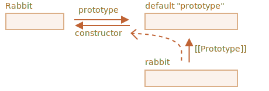

# F.prototype

思い出してください、新しいオブジェクトは `new F()` のように、コンストラクタ関数で生成できます。

`F.prototype` がオブジェクトの場合、`new` 演算子は新しいオブジェクトで `[[Prototype]]` をセットするためにそれを使用します。

```smart
JavaScriptは最初からプロトタイプの継承を持っています。 それは言語の中心的な特徴の1つでした。

しかし、昔は直接アクセスすることはできませんでした。確実に機能したのは、この章で説明する、コンストラクタ関数の `"prototype"` プロパティを使うことです。そして、それを使っているスクリプトはまだたくさんあります。
```

ここで `F.prototype` は `F` 上の `"prototype"` と名付けられた通常のプロパティを意味していることに注意してください。用語 "プロトタイプ" と似ていますが、ここでは本当にその名前をもつ通常のプロパティを意味しています。

ここではその例です:

```js run
let animal = {
  eats: true
};

function Rabbit(name) {
  this.name = name;
}

*!*
Rabbit.prototype = animal;
*/!*

let rabbit = new Rabbit("White Rabbit"); //  rabbit.__proto__ == animal

alert( rabbit.eats ); // true
```

`Rabbit.prototype = animal` の設定は、文字通り次のことを述べています。: "`new Rabbit` が生成される時、その `[[Prototype]]` へ `animal` を割り当てます。"

これが結果のイメージです:


上記の図で、`"prototype"` は水平矢印で、通常のプロパティです。`[[Prototype]]` は縦矢印で、`animal` から `rabbit` の継承を意味しています。

```smart header="`F.prototype` は `new F` 時にだけ使用されます"
`F.prototype` プロパティは `new F` が呼ばれたときにだけ使用され、新しいオブジェクトの `[[Prototype]]` を割り当てます。

作成後に、`F.prototype` プロパティが変更された場合（`F.prototype = <別のオブジェクト>`）、`new F` によって生成された新しいオブジェクトは `[[Prototype]]` として別のオブジェクトを持ちますが、既に存在するオブジェクトは古いものを保持したままです。
```

## デフォルトの F.prototype, constructor プロパティ 

すべての関数は、たとえ明示的に提供されていなくても `"prototype"` プロパティを持っています。

デフォルトの `"prototype"` は `constructor` というプロパティだけを持つオブジェクトで、それは関数自体を指します。

こんな感じです:

```js
function Rabbit() {}

/* デフォルト prototype
Rabbit.prototype = { constructor: Rabbit };
*/
```


コードでそれを確認できます:

```js run
function Rabbit() {}
// デフォルトでは:
// Rabbit.prototype = { constructor: Rabbit }

alert( Rabbit.prototype.constructor == Rabbit ); // true
```

当然、何もしない場合、 `constructor` プロパティは `[[Prototype]]` を通じてすべての rabbit が利用できます。:

```js run
function Rabbit() {}
// デフォルトでは:
// Rabbit.prototype = { constructor: Rabbit }

let rabbit = new Rabbit(); // {constructor: Rabbit} の継承

alert(rabbit.constructor == Rabbit); // true (prototype から)
```



`constructor` プロパティを使って既存のものと同じコンストラクタを使って新しいオブジェクトを作成することができます。

このように:

```js run
function Rabbit(name) {
  this.name = name;
  alert(name);
}

let rabbit = new Rabbit("White Rabbit");

*!*
let rabbit2 = new rabbit.constructor("Black Rabbit");
*/!*
```

これは、オブジェクトを持っているが、どのコンストラクタが使われたか分からない場合(例えばサードパーティーのライブラリが使われているなど)で、同じ種類のものを使って別のオブジェクトを作る必要がある場合に便利です。

しかし、おそらく `"constructor"` に関する最も重要なことは...

**...JavaScript 自体は正しい `"constructor"` 値を保証しません。**

はい、関数のためのデフォルトの `"prototype"` は存在しますが、それがすべてです。その後どうなるかは私たち次第です。

特に、もしデフォルトプロトタイプ全体を置き換えると、その中に `"constructor"` はなくなります。

例:

```js run
function Rabbit() {}
Rabbit.prototype = {
  jumps: true
};

let rabbit = new Rabbit();
*!*
alert(rabbit.constructor === Rabbit); // false
*/!*
```

したがって、正しい `"constructor"` を維持するためには、全体を上書きする代わりに、デフォルト `"prototype"` に対して追加/削除を行います。:

```js
function Rabbit() {}

// 完全に Rabbit.prototype を上書きはしません
// 単に追加するだけです
Rabbit.prototype.jumps = true
// デフォルト Rabbit.prototype.constructor は保持されます
```

もしくは、代替として手動で `constructor` プロパティを再び作ります。:

```js
Rabbit.prototype = {
  jumps: true,
*!*
  constructor: Rabbit
*/!*
};

// 追加したので、これで constructor も正しいです
```


## サマリ 

このチャプターでは、constructor 関数を通して作成されたオブジェクトのための `[[Prototype]]` を設定方法について簡単に説明しました。後で、それに依存するより高度なプログラミングパターンを見ていきます。

すべてが非常にシンプルで、物事を明確にするための留意事項はほんの少しです。:

- `F.prototype` プロパティは `[[Prototype]]` と同じではありません。`F.prototype` がする唯一のことは: `new F()` が呼ばれたときに新しいオブジェクトの `[[Prototype]]` をセットすることです。
- `F.prototype` の値はオブジェクトまたは null でなければなりません。: 他の値では動作しません。
- `"prototype"` プロパティはコンストラクタ関数に設定され、`new` で呼び出されたときにのみ、特別な効果があります。

通常のオブジェクトでは、`prototype` は特別なものではありません。:
```js
let user = {
  name: "John",
  prototype: "Bla-bla" // no magic at all
};
```

デフォルトでは、すべての関数は `F.prototype = { constructor: F }` を持っているので、その `"constructor"` プロパティへアクセスすることで、オブジェクトの constructor を取得することができます。
