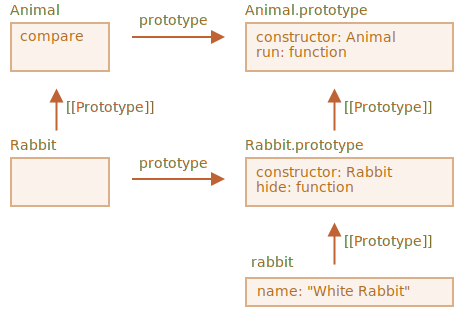

# 静的(static)プロパティとメソッド

クラス全体にメソッドを割り当てることもできます。このようなメソッドは _static(静的)_ と呼ばれます。

クラス宣言の中では、次のように `static` キーワードを付けます。

```js run
class User {
*!*
  static staticMethod() {
*/!*
    alert(this === User);
  }
}

User.staticMethod(); // true
```

これは、実際にはプロパティとして直接割り当てるのと同じことをします。:

```js
class User {}

User.staticMethod = function () {
  alert(this === User);
};

User.staticMethod(); // true
```

`User.staticMethod()` 内の `this` の値はクラスコンストラクタ `User` 自身("ドットの前のオブジェクト" ルール)です。

通常 static メソッドは、クラスには属するが、特定のオブジェクトには属さない関数を実装するのに使用されます。

例えば、`Article` オブジェクトがあり、それらを比較するための関数が必要とします。

自然な解決策は、静的メソッド `Article.compare` を追加することです。:

```js run
class Article {
  constructor(title, date) {
    this.title = title;
    this.date = date;
  }

*!*
  static compare(articleA, articleB) {
    return articleA.date - articleB.date;
  }
*/!*
}

// usage
let articles = [
  new Article("Mind", new Date(2019, 1, 1)),
  new Article("Body", new Date(2019, 0, 1)),
  new Article("JavaScript", new Date(2019, 11, 1))
];

*!*
articles.sort(Article.compare);
*/!*

alert( articles[0].title ); // Body
```

ここでは、`Article.compare` は記事を比較する手段として、記事の “上位” にいます。記事のメソッドと言うよりはクラス全体のメソッドです。

別の例は、いわゆる “ファクトリー” メソッドです。

記事の作成には複数の方法が必要です:

1. 与えられたパラメータ(`title`, `date` など)による作成
2. 今日の日付の空の記事の作成
3. ...

最初の方法はコンストラクタで実装することができます。そして、2 つ目の方法としてはクラスの静的メソッドを作ることができます。

ここでの `Article.createTodays()` を見てください:

```js run
class Article {
  constructor(title, date) {
    this.title = title;
    this.date = date;
  }

*!*
  static createTodays() {
    // 思い出してください, this = Article
    return new this("Today's digest", new Date());
  }
*/!*
}

let article = Article.createTodays();

alert( article.title ); // Todays digest
```

これで今日のダイジェストを作成する必要があるたびに、`Article.createTodays()` を呼べます。改めて言いますが、これは記事のメソッドではなく、クラス全体のメソッドです。

静的メソッドは、次のように、データベース関連のクラスでデータベースの検索/保存/削除のためにも使用されます。:

```js
// Article は記事を管理するための特別なクラスと仮定します
// 記事を削除するための static メソッド:
Article.remove({ id: 12345 });
```

## 静的プロパティ

[recent browser=Chrome]

静的プロパティも可能で、通常のクラスプロパティと同じように見えますが、先頭に `static` が付きます。

```js run
class Article {
  static publisher = "Ilya Kantor";
}

alert(Article.publisher); // Ilya Kantor
```

これは直接 `Article` に代入するのと同じです。:

```js
Article.publisher = "Ilya Kantor";
```

## 静的プロパティとメソッドの継承 [#statics-and-inheritance]

静的プロパティとメソッドは継承されます。

例えば、以下のコードの `Animal.compare` と `Animal.planet` は継承され、`Rabbit.compare` と `Rabbit.planet` としてアクセス可能です。

```js run
class Animal {
  static planet = "Earth";

  constructor(name, speed) {
    this.speed = speed;
    this.name = name;
  }

  run(speed = 0) {
    this.speed += speed;
    alert(`${this.name} runs with speed ${this.speed}.`);
  }

*!*
  static compare(animalA, animalB) {
    return animalA.speed - animalB.speed;
  }
*/!*

}

// Inherit from Animal
class Rabbit extends Animal {
  hide() {
    alert(`${this.name} hides!`);
  }
}

let rabbits = [
  new Rabbit("White Rabbit", 10),
  new Rabbit("Black Rabbit", 5)
];

*!*
rabbits.sort(Rabbit.compare);
*/!*

rabbits[0].run(); // Black Rabbit runs with speed 5.

alert(Rabbit.planet); // Earth
```

`Rabbit.compare` を呼び出すと、継承された `Animal.compare` が呼び出されます。

これはどのように機能しているでしょう？すでに推測したかもしれませんが、`extends` もまた `Rabbit` に `Animal` への参照を持つ `[[Prototype]]` を与えます。



したがって, `Rabbit extends Animal` は 2 つの `[[Prototype]]` の参照を作成します:

1. `Rabbit` 関数は プロトタイプ的に `Animal` 関数を継承しています。
2. `Rabbit.prototype` はプロトタイプ的に `Animal.prototype` を継承しています。

結果、継承は通常のものと静的なメソッド両方で機能します。

ここで、それを確認しましょう:

```js run
class Animal {}
class Rabbit extends Animal {}

// 静的
alert(Rabbit.__proto__ === Animal); // true

// 通常のメソッド
alert(Rabbit.prototype.__proto__ === Animal.prototype); // true
```

## サマリ

静的メソッドは、具体的なクラスインスタンスに関連する機能やインスタンスが存在することを必要する機能ではなく、むしろクラス全体に属している機能のために使用されます。

例えば、比較用のメソッド `Article.compare(article1, article2)` や、ファクトリーメソッド `Article.createTodays()` です。

これらはクラス宣言の中で `static` と言うキーワードでラベル付けされます。

静的プロパティは、クラスレベルのデータを格納するときに使用され、インスタンスにバインドされません。

構文は次の通りです:

```js
class MyClass {
  static property = ...;

  static method() {
    ...
  }
}
```

これは技術的には、クラス自身への代入と同じです:

```js
MyClass.property = ...
MyClass.method = ...
```

静的プロパティは継承されます。

`class B extends A` の場合、クラス `B` 自体のプロトタイプは `A` を指します、: `B.[[Prototype]] = A`。したがって、`B` の中にフィールドが見つからない場合は、検索は `A` の中で続行されます。
